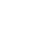

# Morph-SVG

[<h3>Click here to see the demo</h3> ](https://p8me.github.io/morph-svg)

An effort for morphing SVG using [animejs](https://animejs.com/) with the following additions:

1. *Smooth interruptions*: Slowly bring an ongoing animation to halt on events (for example on user interaction)

2. Morph between full SVG files and not just sinlge SVG elements.

## Dependencies

-   [scour](https://github.com/scour-project/scour) for optimizing svgs

## Usage

## TODO

[pure SVG animation](https://developer.mozilla.org/en-US/docs/Web/SVG/Attribute/keySplines)
